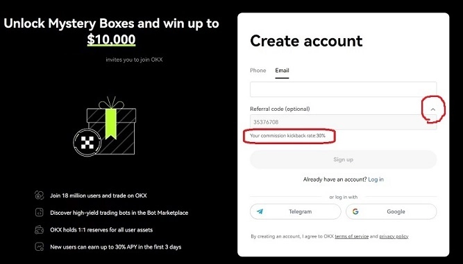
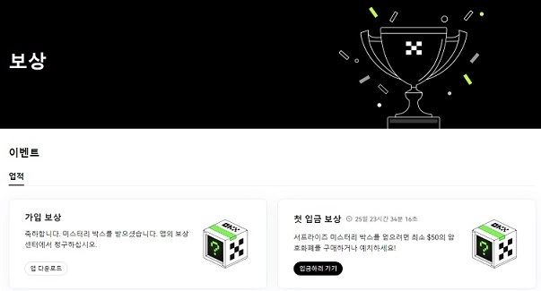

# OKX Exchange: Lifetime 30% Maximum Fee Rebate + Mystery Box with Up to $10,000 in Crypto

**OKX Exchange** offers one of the most competitive trading fee structures in the crypto market. With a maximum 30% perpetual fee rebate and random mystery boxes containing up to $10,000 worth of cryptocurrency, new users can significantly reduce their trading costs while exploring spot, futures, margin, options, and DeFi services. Whether you're a high-frequency trader or just getting started, understanding OKX's fee structure and reward system can help you maximize your returns from day one.

---

**OKX Exchange** is a Hong Kong-based cryptocurrency exchange established in 2014 as a subsidiary of OKcoin. Originally known as OKEX, the platform rebranded to OKX and has grown into a global powerhouse serving over 20 million users across more than 200 countries.

According to CoinMarketCap rankings, OKX consistently maintains a top-6 position for spot trading volume and ranks within the top 3 for futures trading volume. The exchange is a comprehensive trading platform supporting spot, margin, futures, options, perpetual swaps, DeFi, and more.

With over 512 cryptocurrency trading pairs available, OKX processes approximately $15 billion in daily Bitcoin futures trading volume alone. As a VASP Travel Rule compliant exchange, users can freely deposit and withdraw funds to platforms like Upbit without restrictions.

## Maximum 30% Trading Fee Rebate Details

The OKX exchange currently limits the maximum fee rebate to 30% platform-wide. This cap was implemented to prevent excessive discount rates—previous 50% rebate codes have all been adjusted down to the 30% maximum threshold.

👉 [Claim your lifetime 30% fee rebate and start trading with the lowest costs](https://www.okx.com/join/47044926)

**Official Partner Invitation Code:** 47044926

When registering, make sure to click the arrow as shown in the screenshot below and verify that "Your commission kickback rate: 30%" appears. If nothing shows up, you'll receive 0% rebate.

## OKX Exchange Base Trading Fees

**Spot Trading Fees**
- Maker (Limit Order): 0.08%
- Taker (Market Order): 0.10%

**Futures Trading Fees**
- Maker (Limit Order): 0.02%
- Taker (Market Order): 0.05%

With the 30% fee rebate applied, futures trading fees drop to **Maker: 0.014% and Taker: 0.035%**—making OKX one of the most cost-effective platforms for active traders.

## Mystery Box Rewards Program

The Rewards menu offers newly registered users the opportunity to receive random mystery boxes containing up to $10,000 worth of cryptocurrency. You can claim these boxes twice:

1. **First Mystery Box**: Awarded upon installing the app and logging in
2. **Second Mystery Box**: Awarded when you deposit or purchase $50 or more within 30 days

All mystery boxes contain random crypto rewards worth up to $10,000, including BTC, ETH, DOT, USDT, and fee rebate cards. Note that mystery boxes can only be opened through the OKX mobile app.

---

## Conclusion

OKX Exchange combines competitive trading fees, substantial rebate programs, and generous welcome rewards to create a compelling platform for both new and experienced crypto traders. The lifetime 30% fee rebate significantly reduces trading costs, while the mystery box program offers up to $10,000 in additional value. 👉 [Start trading on OKX today and unlock maximum savings with the lowest fees in the industry](https://www.okx.com/join/47044926).
